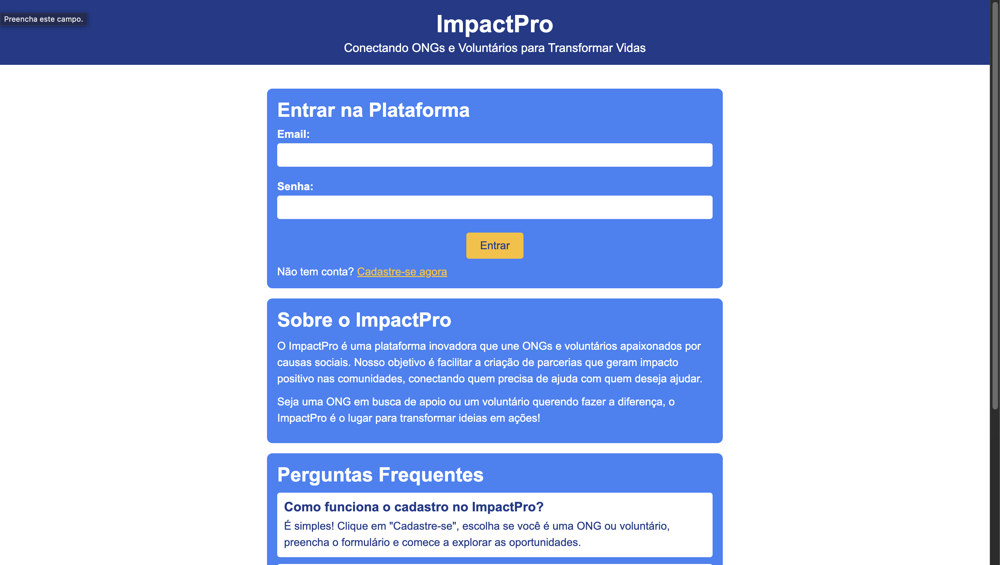
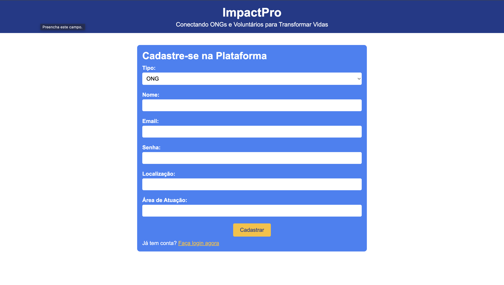
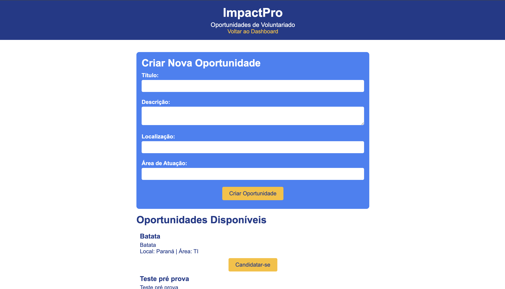
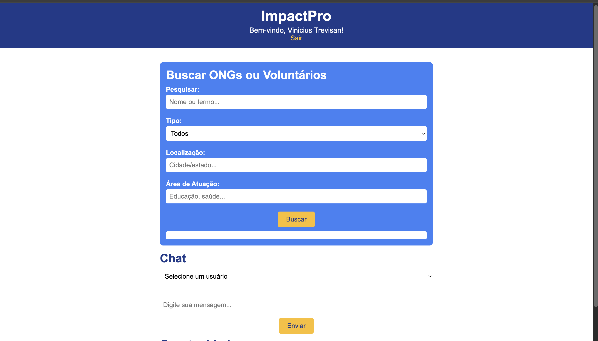

# ImpactPro

Bem-vindo ao **ImpactPro**, uma plataforma web que conecta voluntários e organizações não governamentais (ONGs) para promover impacto social positivo. Nosso objetivo é facilitar a criação e gestão de oportunidades de voluntariado, permitindo que ONGs publiquem oportunidades, voluntários se candidatem e ambos se comuniquem de forma eficiente em um ambiente intuitivo.

 

 

 

 

 


## 📖 Sobre o Projeto

O **ImpactPro** é uma solução inovadora que simplifica o engajamento no voluntariado, conectando pessoas e organizações apaixonadas por causas sociais. A plataforma oferece cadastro de usuários, busca de oportunidades, candidaturas, troca de mensagens e uma interface amigável, promovendo parcerias que transformam comunidades.

### ✨ Funcionalidades Principais
- **Cadastro de Usuários**: ONGs e voluntários podem se registrar com informações como nome, e-mail, localização e área de atuação.
- **Criação e Gestão de Oportunidades**: ONGs criam oportunidades de voluntariado com título, descrição, localização e área de atuação.
- **Candidaturas**: Voluntários podem se candidatar a oportunidades diretamente na plataforma.
- **Busca Avançada**: Filtros por nome, tipo (ONG ou voluntário), localização e área de atuação para encontrar perfis ou oportunidades.
- **Chat Integrado**: Sistema de mensagens para comunicação direta entre usuários.
- **Interface Responsiva**: Design moderno, acessível em desktops e dispositivos móveis.

## 🛠 Tecnologias Utilizadas
- **Frontend**: HTML, CSS, JavaScript
- **Backend**: PHP
- **Banco de Dados**: MySQL (tabelas: `candidaturas`, `mensagens`, `oportunidades`, `usuarios`)
- **Outras Ferramentas**:
  - Bootstrap para estilização
  - jQuery para interatividade
  - Fetch API para requisições assíncronas
- **Versionamento**: Git e GitHub

## 📊 Banco de Dados

O **ImpactPro** utiliza um banco de dados relacional em MySQL com as seguintes tabelas:
- `usuarios`
- `oportunidades`
- `candidaturas`
- `mensagens`

## 📂 Estrutura do Projeto

```plaintext
impactpro/
├── css/
│   └── style.css
├── js/
│   └── script.js
├── php/
│   ├── connect.php
│   ├── chat.php
│   ├── login.php
│   ├── logout.php
│   ├── oportunidades.php
│   ├── register.php
│   └── search.php
├── main/
│   ├── dashboard.php
│   ├── index.html
│   ├── opportunities.php
│   └── register.html
```


## 🤝 Como Contribuir
Contribuições são bem-vindas! Siga os passos abaixo:
1. Faça um fork do repositório.
2. Crie uma branch para sua feature: `git checkout -b minha-feature`.
3. Commit suas alterações: `git commit -m 'Adiciona minha feature'`.
4. Envie para o repositório remoto: `git push origin minha-feature`.
5. Abra um Pull Request.

## 📬 Contato
- **Desenvolvedor**: Vinicius Meier Trevisan
- **LinkedIn**: [](https://www.linkedin.com/in/vinicius-meier-trevisan-741b66329/)
- **E-mail**: [](mailto:vinimtrevisan@gmail.com)


---

**ImpactPro** - Conectando pessoas, transformando comunidades.